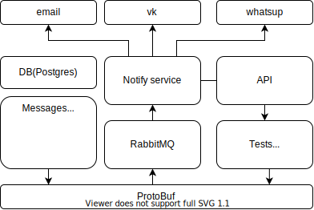

# Notify service for IT Lab system

Status | master | develop
--- | --- | ---
Build |  [![Build Status][build-master-image]][build-master-link] | [![Build Status][build-dev-image]][build-dev-link]

[build-dev-image]: https://dev.azure.com/rtuitlab/RTU%20IT%20Lab/_apis/build/status/ITLab-VKBot?branchName=develop
[build-dev-link]: https://dev.azure.com/rtuitlab/RTU%20IT%20Lab/_build/latest?definitionId=81&branchName=develop
[build-master-image]: https://dev.azure.com/rtuitlab/RTU%20IT%20Lab/_apis/build/status/ITLab-VKBot?branchName=master
[build-master-link]: https://dev.azure.com/rtuitlab/RTU%20IT%20Lab/_build/latest?definitionId=81&branchName=master

## Architecture

